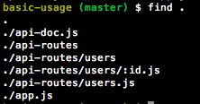
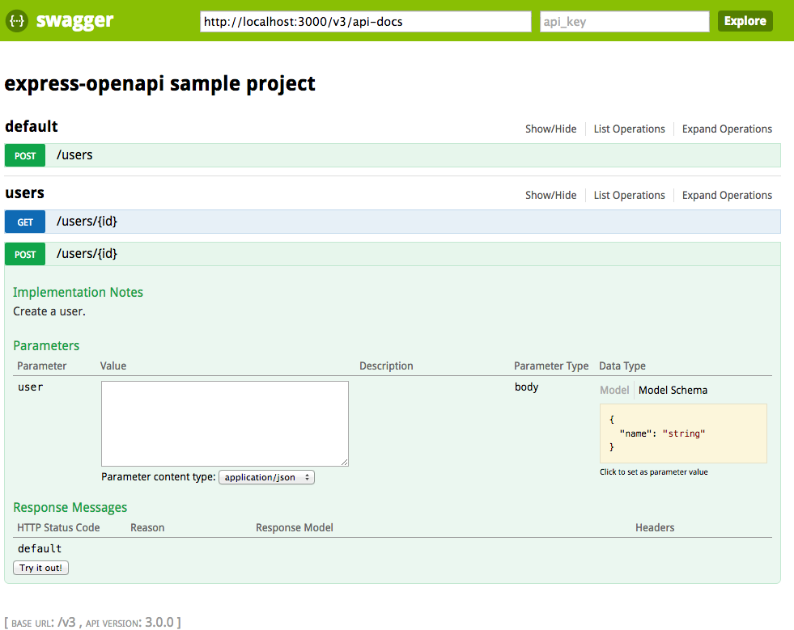

# express-openapi [![NPM version][npm-image]][npm-url] [![Downloads][downloads-image]][npm-url] [![Build Status][travis-image]][travis-url] [![Coveralls Status][coveralls-image]][coveralls-url] [![Gitter chat][gitter-image]][gitter-url]
> An unopinionated openapi framework for express

## Highlights

* Utilizes convention based programming.
* Unobtrusively opinionated.
* Stays as close to `express` as possible.
* Leverages openapi parameter lists for parameter defaults, type coercion,
and validation.
  * See [express-openapi-defaults](https://github.com/kogosoftwarellc/express-openapi-defaults)
  * See [express-openapi-coercion](https://github.com/kogosoftwarellc/express-openapi-coercion)
  * See [express-openapi-validation](https://github.com/kogosoftwarellc/express-openapi-validation)
* Leverages openapi response definitions to provide `res.validateResponse` tailored to a particular route.
  * See [express-openapi-response-validation](https://github.com/kogosoftwarellc/express-openapi-response-validation)
* Leverages security definitions for security management.
  * See [express-openapi-security](https://github.com/kogosoftwarellc/express-openapi-security)
* Validates api documents.
  * See [openapi-schema-validation](https://github.com/kogosoftwarellc/openapi-schema-validation)
* Configurable Middleware.
  * See [Configuring Middleware](#configuring-middleware)
* Performant.
* Supports custom `format` validators.
  * See [args.customFormats](#argscustomformats)
* Supports `collectionFormat` for `formData` `array` parameters.
* Extensively tested.
* Small footprint.
* Currently supports openapi 2.0 (f.k.a. swagger 2.0) documents.
* Conforms to the [single responsibility principle](https://en.wikipedia.org/wiki/Single_responsibility_principle).
* Clean interface.
* Supports error middleware scoped to your API's `basePath`.
  * See [args.errorMiddleware](#argserrormiddleware)
* Adds a route for Swagger UI (`apiDoc.basePath` + `args.docsPath`).
* Adds operation tags to your apiDoc.tags array and sorts them alphabetically for you.
  * See how it's done in the [basic-usage](
https://github.com/kogosoftwarellc/express-openapi/tree/master/test/sample-projects/basic-usage/api-doc.js#L37)
    sample project.
* Supports TypeScript
  * See [Work with TypeScript](#work-with-typescript)
* Supports external schema references
  * See [args.externalSchemas](#argsexternalschemas)
* Client SDK generators available.
  * See [fetch-openapi](https://github.com/kogosoftwarellc/fetch-openapi).

## Example

Let's use the sample project located at [./test/sample-projects/basic-usage/](
https://github.com/kogosoftwarellc/express-openapi/tree/master/test/sample-projects/basic-usage).

The project layout looks something like this:



Here's how we add our routes to express:

```javascript
var app = require('express')();
var bodyParser = require('body-parser');
var openapi = require('express-openapi');
var cors = require('cors');

app.use(cors());
app.use(bodyParser.json());

openapi.initialize({
  apiDoc: require('./api-doc.js'),
  app: app,
  routes: './api-routes'
});

app.use(function(err, req, res, next) {
  res.status(err.status).json(err);
});

app.listen(3000);
```

Our routes are now active and we can test them out with Swagger UI:



For more examples see the [sample projects](https://github.com/kogosoftwarellc/express-openapi/tree/master/test/sample-projects) used in tests.

## Configuring Middleware

You can directly control what middleware `express-openapi` adds to your express app
by using the following vendor extension properties.  These properties are scoped, so
if you use one as a root property of your API Document, all paths and operations will
be affected.  Similarly if you just want to configure middleware for an operation,
you can use these properties in said operation's apiDoc.  See full examples in the
[./test/sample-projects/](
https://github.com/kogosoftwarellc/express-openapi/tree/master/test/sample-projects)
directory.

### Supported vendor extensions

* `'x-express-openapi-additional-middleware': [myMiddleware]` - Adds the provided
middleware _after_ defaults, coercion, and validation middleware (added by
`express-openapi`) but _before_ middleware defined in operations.  This property
inherits from all previous properties.
* `'x-express-openapi-inherit-additional-middleware': false` - Prevents middleware
added in a parent scope with `x-express-openapi-additional-middleware`.  This extension
works from the methodDoc up to the apiDoc, as opposed to the apiDoc down to the methodDoc.
The effect is that using this extension in the methodDoc would prevent that method
from receiving any additional middleware defined in parent scopes.  You can use this
extension in any scope (methodDoc, pathDoc, or apiDoc) and the result i the same.
* `'x-express-openapi-disable-middleware': true` - Disables all middleware.
* `'x-express-openapi-disable-coercion-middleware': true` - Disables coercion middleware.
* `'x-express-openapi-disable-defaults-middleware': true` - Disables
defaults middleware.
* `'x-express-openapi-disable-response-validation-middleware': true` - Disables
response validation middleware I.E. no `res.validateResponse` method will be
available in the affected operation handler method.
* `'x-express-openapi-disable-validation-middleware': true` - Disables input
validation middleware.

## API

### .initialize(args)

Initializes routes and middleware on an express app, and returns an initialized
api.  An initialized api contains the following properties:

* `apiDoc` - This is the final result of the apiDoc after processing.

#### args.apiDoc

|Type|Required|Description|
|----|--------|-----------|
|Object|Y|This is an openapi (swagger 2.0) compliant document.  See the [OpenAPI-Specification](https://github.com/OAI/OpenAPI-Specification/blob/master/versions/2.0.md) for more details.|

`args.apiDoc.paths` should be an empty object.  `express-openapi` will populate this
for you.  This prevents you from defining your paths in 2 places.

`args.apiDoc.basePath` will add a prefix to all routes added by `express-openapi`.

`args.apiDoc.definitions` will be used for de-referencing `$ref` properties in
parameters.

#### args.app

|Type|Required|Description|
|----|--------|-----------|
|Object|Y|The express app you wish to initialize.|

#### args.routes

|Type|Required|Description|
|----|--------|-----------|
|String|Y|A path to the directory that contains your route files.|


Route files are logically structured according to their URL path.  For cross platform
compatibility, URLs that accept a parameter use the swagger format for parameters
as opposed to the express format (i.e. use `{id}` instead of `:id`).  Filenames in
Windows do not allow the `:` character as it is confused with drive names.

For example, if you have the following api routes that you wish to add to your express
app:

```
GET /v1/users/{id}
POST /v1/users
```

You would define `basePath: '/v1'` in your `apiDoc`, and layout your `routes` directory
as follows:

```
<project>
        `routes/
               `users/
                     `{id}.js
                users.js
```

The contents of `<project>/routes/users/{id}.js` would look like this:

```javascript
module.exports = {
  // parameters for all operations in this path
  parameters: [
    {
      in: 'path',
      name: 'id',
      required: true,
      type: 'integer'
    }
  ],

  /*
    Also available are:
    del
    delete
    patch...
    see index.js for the full list.
  */

  get: [
    /* business middleware not expressible by openapi documentation goes here */
    function(req, res, next) {
      var validationError = res.validateResponse(200, /* return the user or an error */);

      if (validationError)
        return next(validationError);
      }

      res.status(200).json(/* return the user or an error */);
    }
  ],

  post: post
};

module.exports.get.apiDoc = {
  description: 'A description for retrieving a user.',
  tags: ['users'],
  operationId: 'getUser',
  // parameters for this operation
  parameters: [
    {
      in: 'query',
      name: 'firstName',
      type: 'string'
    }
  ],
  responses: {
    default: {
      $ref: '#/definitions/Error'
    }
  }
};

function post(req, res, next) {
  /* ... */
}

post.apiDoc = {
  /* ... */
};

```

Modules under `args.routes` expose methods.  Methods may either be a method handler
function, or an array of business specific middleware + a method handler function.

`express-openapi` will prepend middleware to this stack based on the parameters
defined in the method's `apiDoc` property.  If no `apidoc` property exists on the
module method, then `express-openapi` will add no additional middleware.

#### args.docsPath

|Type|Required|Default Value|Description|
|----|--------|-----------|----|
|String|N|/api&#8209;docs|Sets the path that Swagger UI will use to request `args.apiDoc` with populated paths.  You can use this to support multiple versions of your app.|

#### args.errorTransformer

|Type|Required|Description|
|----|--------|-----------|
|Function|N|Transforms errors to a standard format as defined by the application.  See [express-openapi-validation#args.errorTransformer](https://github.com/kogosoftwarellc/express-openapi-validation#argserrortransformer) and [express-openapi-response-validation](https://github.com/kogosoftwarellc/express-openapi-response-validation) for more info.|

#### args.exposeApiDocs

|Type|Required|Default Value|Description|
|----|--------|-----------|-------|
|Boolean|N|true|Adds a route at `args.apiDoc.basePath` + `args.docsPath`.  The route will respond with `args.apiDoc`.|

#### args.validateApiDoc

|Type|Required|Default Value|Description|
|----|--------|-----------|-------|
|Boolean|N|true|Validates `args.apiDoc` before and after path population.  This does not effect individual route validation of route parameters.  You can disable this behavior by passing `false`.|

#### args.customFormats

|Type|Required|Default Value|Description|
|----|--------|-------------|-----------|
|Object|N|null|An object of custom formats.|

Each key is the name of the format to be used with the `format` keyword.  Each value
is a function that accepts an input and returns a boolean value.

```javascript
openapi.initialize({
  /*...*/
  customFormats: {
    myFormat: function(input) {
      return input === 'foo';
    }
  }
  /*...*/
});
```

See Custom Formats in [jsonschema](https://github.com/tdegrunt/jsonschema#custom-formats).

#### args.errorMiddleware

|Type|Required|Default Value|Description|
|----|--------|-------------|-----------|
|Object|N|null|A middleware function that is scoped to your api's basePath.|

This is just standard express error middleware (I.E. it has 4 arguments `err, req, res, next`).
When an error occurs in your API's handlers, it'll be passed to this middleware.  The
rest of your app is unaffected.

```javascript
openapi.initialize({
  apiDoc: require('v3-api-doc'),
  /*...*/
  errorMiddleware: function(err, req, res, next) { // only handles errors for /v3/*
      /* do something with err in a v3 way */
  }
  /*...*/
});
```

#### args.externalSchemas

|Type|Required|Default Value|Description|
|----|--------|-------------|-----------|
|Object|N|null|Map id to pre-loaded external schema|

This is used to resolve a schema reference `$ref`. Id can be a URL or relative path from `args.docPath`.

```javascript
openapi.initialize({
  apiDoc: require('v3-api-doc'),
  /*...*/
  externalSchemas: {
    'http://example.com/schema': {
      description: "example schema",
      type: object,
      /*....*/
    },
    'http://example.com/another-schema': {
      /*....*/
    }
  }
  /*...*/
});
```

And then you can reference them in your api-doc file and route handlers.
```javascript
{
  /*...*/
  parameters: {
    foo: {
      "in": "body",
      name: "foo",
      schema: { $ref: 'http://example.com/schema'}
    }
  },
  /*...*/
  definitions: {
   bar: { $ref: 'http://example.com/another-schema#/definitions/bar'}
  }
}
```
or
```javascript
module.exports.put.apiDoc = {
  /*...*/
  parameters: [
    {
      "in": "body",
      name: "foo",
      schema: { $ref: 'http://example.com/schema'}
    }
  ],
 /*...*/
}
```

#### args.securityHandlers

|Type|Required|Default Value|Description|
|----|--------|-------------|-----------|
|Object|N|null|Map name of security scheme name to a handler function.|

If you'd like to support security, define your schemes in your apiDoc like so:

```javascript
var apiDoc = {
  swagger: 2.0,
  /* ... */
  securityDefinitions: {
    keyScheme: {
      type: 'apiKey',
      name: 'api_key',
      in: 'header'
    },
    passwordScheme: {
      type: 'basic'
    }
  }
};
```

Define your security handlers in the openapi initialization args:

```javascript
openapi.initialize({
  apiDoc: apiDoc,
  app: app,
  securityHandlers: {
    keyScheme: function(req, scopes, definition, cb) {
      /* do something.  You can assign values to req to make them available in
      operation handlers. */
      cb(null, true);
    },
    passwordScheme: function(req, scopes, definition, cb) {
      /* do something */
      cb({
        status: 401,
        challenge: 'Basic realm=foo',
        message: 'You must authenticate to access foo.'
      });
    }
  }
});
```

Now you can use `security` in your operation docs, or in the api doc.

```javascript
module.exports = {
  post: post
};

function post(req, res, next) {
  /* code */
}

post.apiDoc = {
  /* ... */
  security: [
    {
      passwordScheme: []
    },
    // if the previous set of security schemes fail, we move to the next block.
    {
      keyScheme: []
    }
  ]
};
```

See [express-openapi-security](https://github.com/kogosoftwarellc/express-openapi-security)
for more details.

## Work with TypeScript

This package includes definition for TypeScript.

### Prepare

Install definition for `express` and `body-parser`(optional) via [typings](https://www.npmjs.com/package/typings).

### Example

In server script:
```typescript
import * as express from "express";
import * as bodyParser from "body-parser";
import * as openapi from "express-openapi";

var app = express();

app.use(bodyParser.json());

openapi.initialize({
    apiDoc: require('./api-doc.js'),
    app: app,
    routes: './built/api-routes'
});

app.use(<express.ErrorRequestHandler>(err, req, res, next) => {
    res.status(err.status).json(err);
});

app.listen(3000);
```

In route handler file like `<project>/src/api-routes/users/{id}.ts`:
```typescript

import {Operation} from "express-openapi";

export var parameters = [
  {
    in: 'path',
    name: 'id',
    required: true,
    type: 'integer'
  }
 ];

export var get: Operation = [
    /* business middleware not expressible by openapi documentation goes here */
    (req, res, next) => {
        res.status(200).json(/* return the user */);
    }
];

get.apiDoc = {
  description: 'A description for retrieving a user.',
  tags: ['users'],
  operationId: 'getUser',
  // parameters for this operation
  parameters: [
    {
      in: 'query',
      name: 'firstName',
      type: 'string'
    }
  ],
  responses: {
    default: {
      $ref: '#/definitions/Error'
    }
  }
};

export var post: Operation = (req, res, next) => {
    /* ... */
}

post.apiDoc = {
    /* ... */
};
```

## LICENSE
``````
The MIT License (MIT)

Copyright (c) 2016 Kogo Software LLC

Permission is hereby granted, free of charge, to any person obtaining a copy
of this software and associated documentation files (the "Software"), to deal
in the Software without restriction, including without limitation the rights
to use, copy, modify, merge, publish, distribute, sublicense, and/or sell
copies of the Software, and to permit persons to whom the Software is
furnished to do so, subject to the following conditions:

The above copyright notice and this permission notice shall be included in
all copies or substantial portions of the Software.

THE SOFTWARE IS PROVIDED "AS IS", WITHOUT WARRANTY OF ANY KIND, EXPRESS OR
IMPLIED, INCLUDING BUT NOT LIMITED TO THE WARRANTIES OF MERCHANTABILITY,
FITNESS FOR A PARTICULAR PURPOSE AND NONINFRINGEMENT. IN NO EVENT SHALL THE
AUTHORS OR COPYRIGHT HOLDERS BE LIABLE FOR ANY CLAIM, DAMAGES OR OTHER
LIABILITY, WHETHER IN AN ACTION OF CONTRACT, TORT OR OTHERWISE, ARISING FROM,
OUT OF OR IN CONNECTION WITH THE SOFTWARE OR THE USE OR OTHER DEALINGS IN
THE SOFTWARE.
``````

[downloads-image]: http://img.shields.io/npm/dm/express-openapi.svg
[npm-url]: https://npmjs.org/package/express-openapi
[npm-image]: http://img.shields.io/npm/v/express-openapi.svg

[travis-url]: https://travis-ci.org/kogosoftwarellc/express-openapi
[travis-image]: http://img.shields.io/travis/kogosoftwarellc/express-openapi.svg

[coveralls-url]: https://coveralls.io/r/kogosoftwarellc/express-openapi
[coveralls-image]: http://img.shields.io/coveralls/kogosoftwarellc/express-openapi/master.svg

[gitter-url]: https://gitter.im/kogosoftwarellc/express-openapi
[gitter-image]: https://badges.gitter.im/kogosoftwarellc/express-openapi.png
